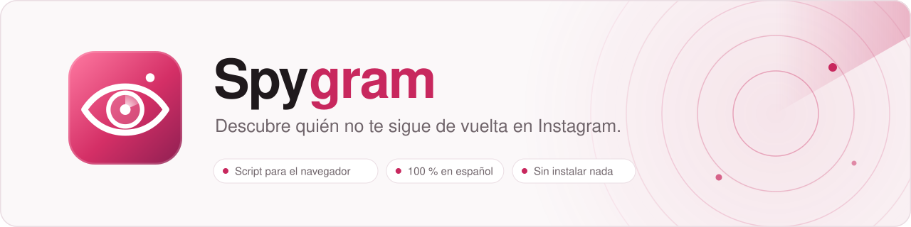
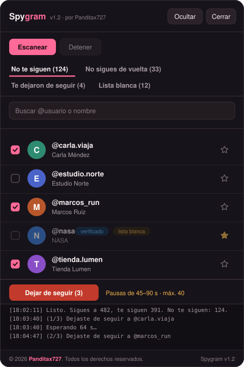

<picture>
  <source media="(prefers-color-scheme: dark)" srcset="assets/banner-dark.svg">
  
</picture>

  

 

## &nbsp; Qué hace

<table>
<tr><td width="50%" valign="top">&nbsp; <b>No te siguen</b> Cuentas que sigues pero que no te siguen de vuelta.</td><td width="50%" valign="top">&nbsp; <b>No sigues de vuelta</b> Cuentas que te siguen y a las que tú no sigues.</td></tr>
<tr><td width="50%" valign="top">&nbsp; <b>Te dejaron de seguir</b> Compara con tu escaneo anterior y te dice quién se fue.</td><td width="50%" valign="top">&nbsp; <b>Lista blanca</b> Marca famosos, marcas o amigos para excluirlos siempre.</td></tr>
<tr><td width="50%" valign="top">&nbsp; <b>Pausas seguras</b> Esperas aleatorias, descansos cada 10 cuentas y límite por sesión.</td><td width="50%" valign="top">&nbsp; <b>Buscador y filtros</b> Busca por usuario o nombre y oculta cuentas verificadas.</td></tr>
<tr><td width="50%" valign="top">&nbsp; <b>Copiar la lista</b> Exporta los usuarios visibles con un clic.</td><td width="50%" valign="top">&nbsp; <b>Privado</b> Sin servidores: tus datos no salen de tu navegador.</td></tr>
</table>

 

  
   
  El panel de Spygram dentro de instagram.com

 

## &nbsp; Archivos

| Archivo | Para qué sirve |
|---|---|
| [`spygram.js`](spygram.js) | El script. Se pega en la consola del navegador en instagram.com. |
| [`spygram-marcador.txt`](spygram-marcador.txt) | El mismo script en formato marcador (bookmarklet), para el móvil. |
| [`index.html`](index.html) | Versión web sin iniciar sesión: analiza la descarga de datos que te da Instagram. |

## &nbsp; Uso en el ordenador

Funciona en Chrome, Edge, Brave y Firefox.

1. Abre **[instagram.com](https://www.instagram.com)** e inicia sesión.
2. Pulsa **`F12`** (o `Ctrl + Mayús + J`) y ve a la pestaña **Consola**.
3. La primera vez, el navegador no te dejará pegar código. Escribe `allow pasting` (o `permitir pegar`) y pulsa Intro.
4. Copia todo el contenido de [`spygram.js`](spygram.js), pégalo en la consola y pulsa Intro.
5. En el panel que aparece a la derecha, pulsa **Escanear**.

> [!TIP]
> En Chrome, Brave y Edge puedes guardarlo como *Snippet* (DevTools → Sources → Snippets) y ejecutarlo con `Ctrl + Enter` cada vez que quieras.

## &nbsp; Uso en el móvil

<b>Android (Chrome)</b>

 

1. Copia todo el contenido de [`spygram-marcador.txt`](spygram-marcador.txt).
2. Guarda cualquier página como marcador (icono de estrella de la barra), edítalo, ponle de nombre `spygram` y pega el texto en el campo **URL**.
3. Abre **instagram.com** en Chrome (no en la app) con tu sesión iniciada.
4. Escribe `spygram` en la barra de direcciones y **toca la sugerencia del marcador**. Si pulsas Intro, Chrome hace una búsqueda y no funciona.

<b>iPhone (Safari)</b>

 

1. Copia todo el contenido de [`spygram-marcador.txt`](spygram-marcador.txt).
2. Añade cualquier página a Marcadores → **Editar** → toca el marcador nuevo.
3. Cambia el nombre a `Spygram` y reemplaza la dirección con el texto copiado.
4. Abre **instagram.com** en Safari con tu sesión iniciada, abre Marcadores y toca **Spygram**.

## &nbsp; Modo sin iniciar sesión

Si no quieres ejecutar nada en tu cuenta, abre [`index.html`](index.html) en el navegador y usa la descarga oficial de tus datos:

1. En Instagram: **Configuración** → **Centro de cuentas** → **Tu información y permisos** → **Descargar tu información**.
2. Elige **Parte de tu información** → **Seguidores y seguidos**.
3. Formato **JSON**, intervalo **Desde el principio** → **Crear archivos**.
4. Cuando te llegue el correo, descarga el `.zip` y arrástralo a la página.

Este modo no toca tu cuenta, así que no hay ningún riesgo de bloqueo.

## &nbsp; Cómo usarlo sin que Instagram te limite

| Recomendación | Por qué |
|---|---|
| No pases de **100–150 unfollows al día** | Instagram limita las cuentas con actividad masiva. |
| Hazlo en **tandas de 30–40** separadas por horas | Parece actividad normal. |
| Usa el modo **Muy seguro (45–90 s)** | Sobre todo si tu cuenta es nueva o tiene poca actividad. |
| Si ves **"Intenta más tarde"**, para y espera **24–48 h** | Insistir alarga la limitación. Spygram se detiene solo si lo detecta. |
| No lo uses a la vez que otras apps de seguidores | Suma actividad y aumenta el riesgo. |

> [!WARNING]
> **El unfollow automático es experimental.** Instagram cambia sus rutas internas a menudo. Si ves `No se pudo con @usuario` en el registro del panel, el escaneo sigue funcionando: usa la lista y deja de seguir a mano desde el enlace de cada perfil. Spygram se detiene solo tras 3 fallos seguidos.

## &nbsp; Preguntas frecuentes

<b>¿Es seguro pegar esto en la consola?</b>

 

El código es abierto y puedes leerlo entero en [`spygram.js`](spygram.js). Solo se comunica con `instagram.com` usando tu propia sesión y no envía datos a ningún otro sitio. Aun así, **nunca pegues en la consola código de fuentes en las que no confíes.**

<b>¿Dónde se guardan la lista blanca y los escaneos?</b>

 

En el `localStorage` de tu navegador, dentro de instagram.com. No salen de tu equipo. Si borras los datos del sitio, se pierden.

<b>No aparecen las fotos de perfil</b>

 

Algunos navegadores (como Brave con el escudo activado) bloquean las imágenes de Instagram. En ese caso, Spygram muestra un círculo de color con la inicial de la cuenta.

<b>Pegué el script dos veces y no pasa nada</b>

 

Si el panel ya está abierto, el script solo lo vuelve a mostrar. Recarga la página con `F5` para empezar de cero.

## &nbsp; Autor

<table>
<tr>
<td></td>
<td>Diseñado y desarrollado por <b><a href="https://github.com/Panditax727">Panditax727</a></b>. Si te resulta útil, puedes darle una estrella al repositorio.</td>
</tr>
</table>

## &nbsp; Aviso legal

© 2026 Panditax727. Todos los derechos reservados.

Spygram no está afiliado, asociado ni respaldado por Instagram ni por Meta Platforms, Inc. "Instagram" es una marca registrada de Meta Platforms, Inc. Úsalo bajo tu propia responsabilidad y respetando las [Condiciones de uso de Instagram](https://help.instagram.com/581066165581870).
